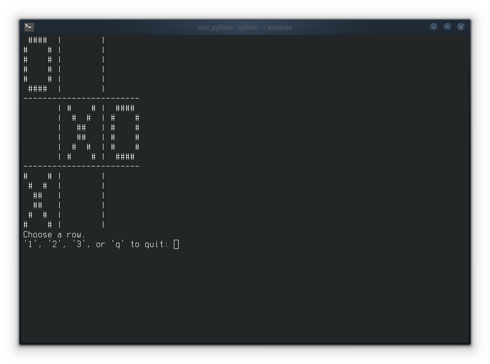

# Tic Tac Toe

- This is my version of the tic tac toe game.
- I did this just to practice whatever Python skills I have at the moment.
- I did all from scratch, no tutorial, no previous knowledge on this kind of thing.
- For this reason the code may look disappointingly amateurish to most of you.

## Things to fix (the ones I am aware of, that is)

- There is no artificial intelligence, so it is very easy to win.
- Game will run forever if no one wins. Only way to quit for now is pressing 'q' when prompted.

## A screenshot of the game

